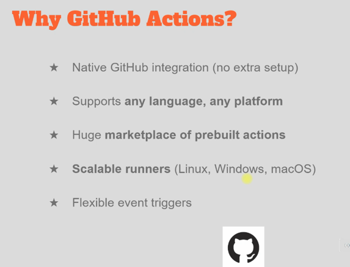
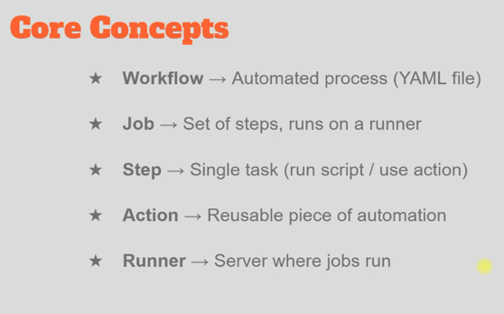
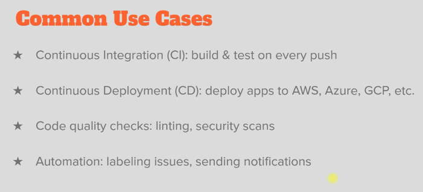

* In this section we will be learning GitHub actions, a built-in CI/CD workflow in GitHub. In short it is a CI/CD platform built into GitHub.
* Github repo --> actions --> can configure workflow (CI/CD pipeline in github actions is called workflow)
    - The workflow will be written in YAML format ([_sample workflow_](sample-workflow.yaml))
    - When we create a workflow in github it will be located in the `.github/workflows` folder inside the repo
    - Can automate the tasks -- testing, building, deployment, notifications...

1. Introduction

2. [_quickstart_](quickstart) --> uses the code in [_vprofile-project folder_](vprofile-project)